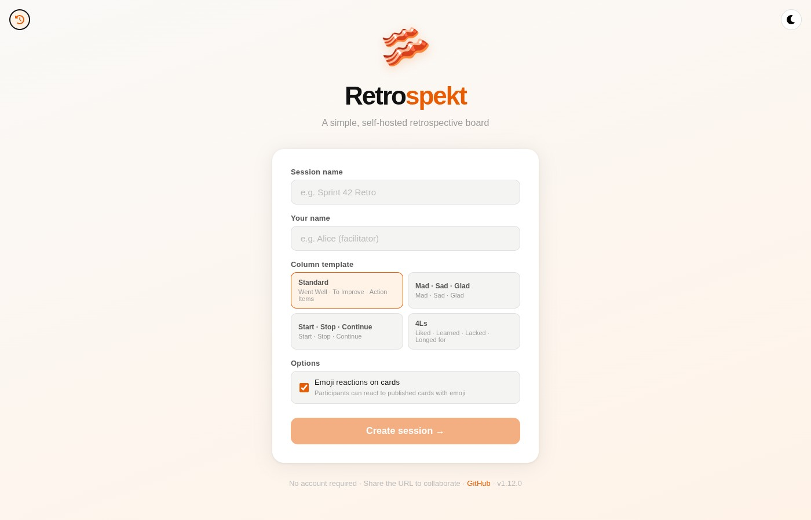
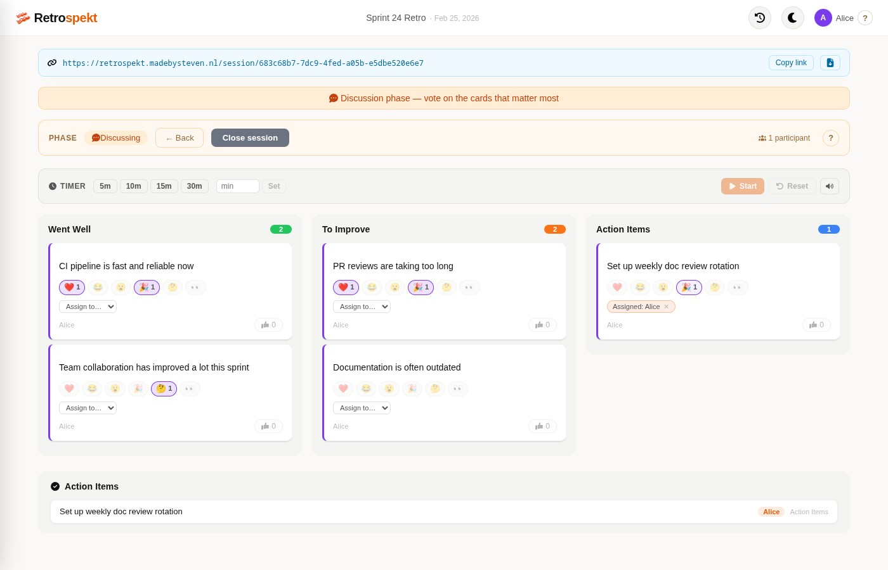

# Retrospekt 🥓

[](https://github.com/stevendejongnl/retrospekt/actions/workflows/release.yml)
[](https://github.com/stevendejongnl/retrospekt/releases)
[](https://codecov.io/gh/stevendejongnl/retrospekt)

A simple, self-hosted retrospective board.

**retro_spek_t** — *spek* is Dutch for bacon.

## Preview

**Live demo:** [retrospekt.madebysteven.nl](https://retrospekt.madebysteven.nl)

| Home | Board (discussing phase) |
|------|--------------------------|
|  |  |

## Features

- UUID-based sessions — no accounts, no login
- Share a URL to collaborate in real time
- Column templates: Standard, Mad·Sad·Glad, Start·Stop·Continue, 4Ls
- Column management: add, rename, and delete columns (facilitator, collecting phase only)
- Per-session name (remembered in localStorage)
- Color-coded participants and cards — 10-color palette, consistent per participant
- Vote on cards (idempotent, one vote per participant per card)
- Emoji reactions on published cards (6 fixed emoji, toggle per participant)
- Emoji picker for card text input
- Card publishing: each author publishes their own cards during discussing phase
- Action items: assign cards to participants; action items panel for quick review
- Session timer: facilitator-controlled countdown (30 s – 2 h), with pause/resume/reset
- Export session as Markdown (published cards, reactions, assignees)
- Facilitator controls: collecting ↔ discussing ↔ closed phases (bidirectional)
- Real-time updates via Server-Sent Events (auto-reconnects)
- Session history sidebar: up to 50 past sessions persisted in localStorage
- Dark mode with persisted preference (CSS custom properties)
- Session auto-expiry: sessions deleted after 30 days of inactivity

## Stack

| Layer | Technology |
|-------|-----------|
| Frontend | Vite + Lit + TypeScript |
| Backend | Python FastAPI + uv |
| Database | MongoDB (Motor async driver) |
| Real-time | Server-Sent Events (SSE) + Redis pub/sub |
| Monitoring | Sentry (frontend + backend) |
| Deployment | Docker Compose / Kubernetes |

## Running locally

```bash
make install      # install dependencies + git hooks
make start        # build images and start MongoDB + backend + frontend
make logs         # tail logs from all services
make stop         # stop everything
```

| Service | URL |
|---------|-----|
| Frontend | http://localhost:3001 |
| Backend API | http://localhost:8001 |
| Health check | http://localhost:8001/health |

## API

```
GET  /health

POST   /api/v1/sessions                                          create session (columns optional)
GET    /api/v1/sessions/{id}                                     get session (no facilitator_token)
POST   /api/v1/sessions/{id}/join                               join session (adds participant)
POST   /api/v1/sessions/{id}/phase                              set phase (X-Facilitator-Token required)
GET    /api/v1/sessions/{id}/stream                             SSE stream

POST   /api/v1/sessions/{id}/columns                            add column (facilitator, collecting only)
PATCH  /api/v1/sessions/{id}/columns/{name}                     rename column (facilitator, collecting only)
DELETE /api/v1/sessions/{id}/columns/{name}                     remove column + its cards (facilitator, collecting only)

POST   /api/v1/sessions/{id}/cards                              add card (collecting phase)
DELETE /api/v1/sessions/{id}/cards/{card_id}                    delete own card
POST   /api/v1/sessions/{id}/cards/{card_id}/votes              vote (idempotent)
DELETE /api/v1/sessions/{id}/cards/{card_id}/votes              remove vote
POST   /api/v1/sessions/{id}/cards/{card_id}/publish            publish own card (discussing phase)
POST   /api/v1/sessions/{id}/cards/publish-all                  publish all own cards in a column (discussing phase)
POST   /api/v1/sessions/{id}/cards/{card_id}/reactions          add emoji reaction (discussing/closed)
DELETE /api/v1/sessions/{id}/cards/{card_id}/reactions          remove emoji reaction (?emoji=...)
PATCH  /api/v1/sessions/{id}/cards/{card_id}/assignee           set or clear assignee (author or facilitator)

PATCH  /api/v1/sessions/{id}/timer                              set timer duration (facilitator)
POST   /api/v1/sessions/{id}/timer/start                        start or resume timer (facilitator)
POST   /api/v1/sessions/{id}/timer/pause                        pause timer (facilitator)
POST   /api/v1/sessions/{id}/timer/reset                        reset timer (facilitator)
```

Every mutation broadcasts the full updated session JSON to all connected SSE clients.

## Session lifecycle

1. Open the app → enter session name + your name → choose a column template → **Create session**
2. Share the URL with your team
3. Everyone enters their name on first visit
4. Facilitator can add, rename, or delete columns during the **Collecting** phase
5. Add cards privately during **Collecting** — only you see your own cards
6. Facilitator moves to **Discussing** — participants publish their own cards; facilitator can publish-all per column
7. Vote and react to published cards; assign action items to participants
8. Facilitator moves to **Closed** when done (or steps back to any earlier phase if needed)

Only the creator (identified by `facilitator_token` in localStorage) sees the phase controls.

## Development

```bash
make install      # uv sync + npm install + git hooks
nox               # run all checks: lint + mypy + pytest (backend), lint + typecheck (frontend)
```

See [CLAUDE.md](CLAUDE.md) for the full command reference (per-layer test runs, coverage, E2E).

## Deployment

A `kubernetes.yaml` is included with Namespace, Deployments, Services, and an Ingress. Update the `host` field in the Ingress spec to your own domain before applying. The Ingress sets `proxy-buffering: off` and a long `proxy-read-timeout` to keep SSE connections alive through nginx.

Create the MongoDB secret before applying:

```bash
kubectl create secret generic retrospekt-mongodb-secret \
  --namespace retrospekt \
  --from-literal=mongodb-url='mongodb+srv://...'

kubectl apply -f kubernetes.yaml
```

Backend env vars: `MONGODB_URL`, `MONGODB_DATABASE`, `SESSION_EXPIRY_DAYS` (default: 30), `REDIS_URL`, `SENTRY_DSN` (optional).
